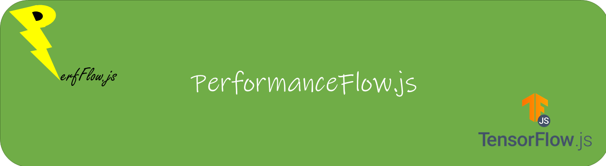

   

-----------------

# Table of Contents
- [What is it](#what_is_it)
- [Main Features](#main-features)  
- [How to run](#how_to_run)
- [Project Structure](#project_structure)
- [Where to Run PerfFlow.js](#where-to-use)   
- [How to Run PerfFlow.js](#how-to-run)
- [Discussion and Development](#dev)
- [Contribution](#contri)

# PerfFlow.js: a powerful javascript performance analysis module

# What is it? 

**PerfFlow.js** is a javascript package that allows flexible, and expressive runtime speculation designed to make *your* data query-heavy applications more interactive! 
It has been developed targeting  the [SUSTAIN](http://urban-sustain.org) groups [Aperture](https://github.com/Project-Sustain/aperture-client) Project. 

# Main Features 

- PerfFlow.js is built on Tensorflow.js, with D3.js and Leaflet.js among other packages. 
- It provides neat-looking correlograms to compare the correlation of the features that it captures.  
- It provides functions to train Linear and Non-Linear Regression neural nets to determine the optimum load a device can and should be able to handle.
- It is built for [*Leaflet.js*](https://github.com/Leaflet/Leaflet) and Uses Leaflet EasyButton to allow you to create your own custom buttons to extend functionality.

# Project Structure 
    index.html    # main page of the client
    /images       # where images for the client are stored
    /src
        /iframe           # Where the frame code is, read this directories' README for a full description
        /dependencies     # index.html's dependencies
    /test         # where mocha test code lives

# Where to use it 
# How to run 
1. Clone the respository
2. Navigate to the perfflow-js directory
3. Run `npm install`
4. Perform any clean-up or audit operations requested by NPM (not necessary, but good practice)
6. The sample webserver can now be started with the `npm run serve` command

# Discussion and Development 
Documents leading to the structure, architecture and planning for this module can be found [here](Folder-with-ppt-docs))

# Contributing to PerfFlow 
All contributions, bug reports, bug fixes, documentation improvements, enhancements, and ideas are welcome.

#### Licence: [MIT](https://github.com/opensource9ja/danfojs/blob/master/LICENCE)

#### Created by [Sanket Mehrotra](https://github.com/mehrotrasan16)